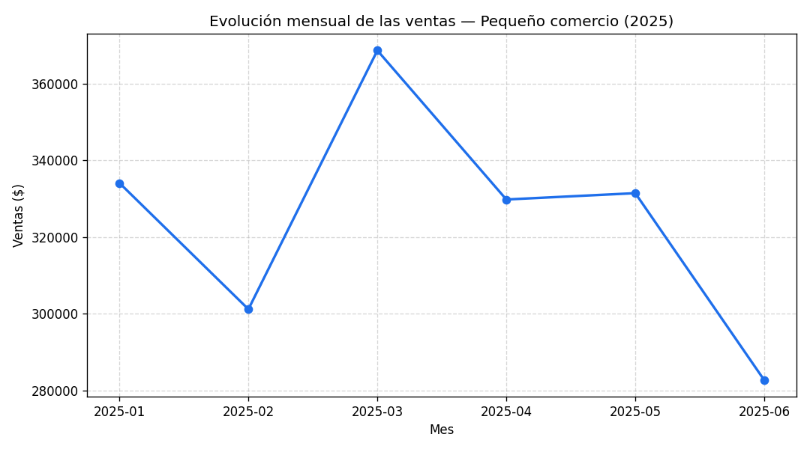
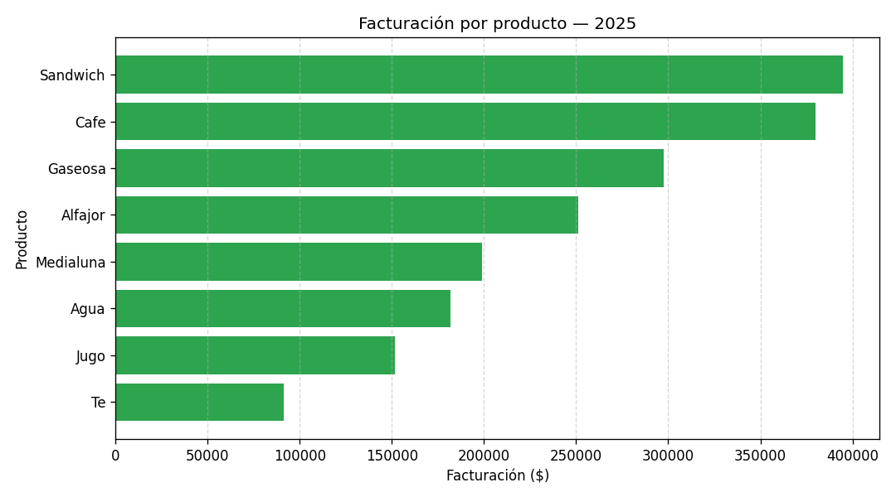

Trabajo Práctico: **Gestión Colaborativa, Control de Versiones y Organización
Empresarial (Git, GitHub y Jira)**
Cátedra: **Organización Empresarial** — Tecnicatura Universitaria en Programación
(TUP), Universidad Tecnológica Nacional (UTN) — Modalidad a Distancia. Año 2026.


Este repositorio implementa el **Escenario B – Análisis de Ventas de una pequeña
empresa**. A partir de un conjunto de datos de ventas de un comercio (cafetería /
almacén), un script en Python calcula indicadores básicos de desempeño y genera un
gráfico con la evolución mensual de la facturación.

El objetivo para este trabajo no es solo el análisis de datos, sino **aplicar un flujo de
trabajo colaborativo profesional**: planificación en Jira, control de versiones con
Git, repositorio central en GitHub, ramas, *Pull Requests* y trazabilidad entre cada
commit y su tarea de Jira.


El trabajo se resolvió de forma individual **simulando los tres roles** de la célula
ágil descripta en la consigna (caso Hugo, Paco y Luis):

| Rol | Personaje | Responsabilidad | Integrante |
|-----|-----------|-----------------|------------|
| P1  | Hugo  | Líder y Organizador (repo, estructura, README) | Joaquín Bianco Merlini |
| P2  | Paco  | Desarrollador Técnico (script de análisis)     | Joaquín Bianco Merlini |
| P3  | Luis  | Revisor y QA (documentación, seguridad, PR)    | Joaquín Bianco Merlini |

Comisión: 5.


**Escenario B – Análisis de Ventas de una Pequeña Empresa.**
Se analiza la información de ventas para generar indicadores que permitan interpretar
el desempeño del comercio:

- Ventas totales del período.
- Producto más vendido (por unidades y por facturación).
- Ventas por mes.
- Gráfico de evolución de las ventas en el tiempo.


- **Archivo:** [`datos/ventas.csv`](datos/ventas.csv)
- **Origen:** datos **simulados** generados por el equipo con un script reproducible
  (semilla fija), siguiendo la estructura de los datasets de ventas sugeridos en la
  consigna (columnas `fecha`, `producto`, `cantidad`, `precio`).
- **Período:** 01/01/2025 a 30/06/2025.
- **Registros:** 710 operaciones de venta.
- **Columnas:**

| Columna | Tipo | Descripción |
|---------|------|-------------|
| `id` | entero | Identificador único de la operación |
| `fecha` | fecha (YYYY-MM-DD) | Día de la venta |
| `producto` | texto | Producto vendido (Café, Té, Medialuna, etc.) |
| `cantidad` | entero | Unidades vendidas en la operación |
| `precio_unitario` | entero | Precio por unidad, en pesos |

El importe de cada venta (`cantidad * precio_unitario`) se calcula dentro del script.

```
analisis-ventas-tup/
│
├── datos/
│   └── ventas.csv
│
├── scripts/
│   ├── generar_datos.py
│   └── analisis_ventas.py
│
├── resultados/
│   ├── grafico_ventas_por_mes.png
│   ├── grafico_facturacion_por_producto.png
│   ├── resumen_indicadores.txt
│   ├── ventas_por_mes.csv
│   └── facturacion_por_producto.csv
│
├── README.md
└── .gitignore
```


> Requisitos: Python 3 con las librerías `pandas` y `matplotlib` (ya vienen
> preinstaladas en Google Colab). Para instalarlas localmente:
> `pip install pandas matplotlib`.

Desde la **raíz del repositorio**:

```bash

python scripts/generar_datos.py


python scripts/analisis_ventas.py
```

El script de análisis:
1. Lee `datos/ventas.csv`.
2. Calcula los indicadores.
3. Genera **dos gráficos** y los archivos de resultados dentro de `resultados/`.
4. Imprime un resumen por pantalla.

Las rutas son **portables** (se calculan en relación a la ubicación del script), por
lo que funciona igual en Colab, Windows o Linux, sin depender de rutas absolutas.

> **Reproducibilidad:** `generar_datos.py` usa una semilla fija (`random.seed`), por lo
> que siempre produce el mismo `ventas.csv`. Cualquiera puede recrear y verificar los
> resultados sin depender de archivos externos.


- **Ventas totales:** $1.947.600
- **Producto más vendido (unidades):** Café (475 unidades)
- **Producto que más facturó:** Sándwich ($395.000)
- **Mejor mes:** Marzo 2025 ($368.600)






La planificación se gestionó en un tablero de Jira con tres *issues* (uno por rol).
Cada commit comienza con el ID del issue correspondiente (Conventional Commits),
por ejemplo:

```
PROY-1: Inicializar estructura de carpetas y README
PROY-2: Agregar script de análisis de ventas y dataset
PROY-3: Mejorar documentación y comentarios tras peer review
```

- **Lenguaje:** Python 3
- **Librerías:** pandas, matplotlib
- **Entorno de ejecución:** Google Colab
- **Control de versiones:** Git + GitHub
- **Gestión de tareas:** Jira
